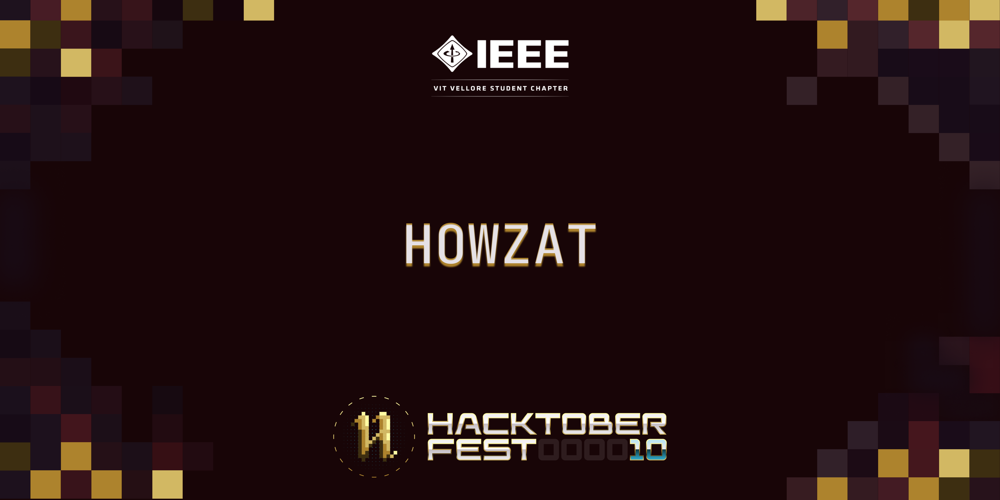

# Howzat

## About

This website is aimed at keeping cricket fans updated on the current ICC Men’s Cricket World Cup 2023. Upon opening the website, you will be directed to the Home page, where you can find a navigation bar at the top leading to different tabs:

- **Standings:** This section displays the current standings of the teams. (standings.html, standings.css)
- **Fixtures:** Here, you can find the schedule of matches from the beginning to the finals, including details about each match and its venue. (fixtures.html, fixtures.css)
- **Fan Poll:** This section helps you find the probability of a team winning or losing a particular match based on the results of a poll conducted by fans before every match.

The Home page also contains:

- The official ICC World Cup 23 logo
- A list of teams participating in the ICC World Cup 2023
- Social links in the footer of the page

By clicking on each country's icon, you must be redirected to a page containing squad details.   
You can check out the website [here](https://ieee-cwc.onrender.com/). 
It will automatically be redeployed whenever a PR is merged

## Tech Stack

- HTML5
- CSS
- JavaScript
- Flask
- Jinja2
- SQLite (Database)
- OAuth

## Structure

The website is structured according to Flask, organized into the following components:

- **Templates Folder:** Contains all HTML files
- **Static Folder:** Contains subfolders storing styling files (CSS), images (SVG), and relevant JavaScript files
- **Python Files:** app.py, config.py

## Getting Started

1. Clone the repository: `git clone https://github.com/IEEE-VIT/Howzat`
2. Checkout to a new branch: `git checkout -b my-amazing-feature`
3. Make your changes.
4. `git add .`
5. `git commit -m "A short description of the feature."`
6. `git push origin my-amazing-feature`
7. Open a pull request to the curated issues.

To start contributing, [CONTRIBUTING.md](https://github.com/IEEE-VIT/Howzat/blob/main/CONTRIBUTING.md) .  Feel free to fork the repository and submit a pull request with your changes. We welcome improvements, bug fixes, and additional features!